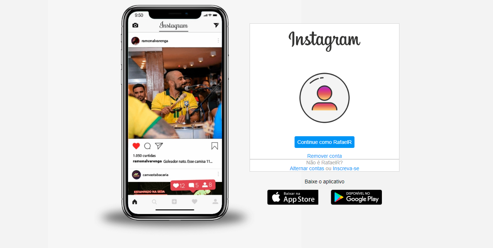

<h1 align="center">📱Clone da interface do Instagram</h1>

<h3 align="center">Projeto desenvolvido no Bootcamp Front-End da DIO.</h3>

 

  

 

  

Acesse o projeto [aqui](https://fel1324.github.io/Clone-interface-Instagram/)

 

## 🚀 Tecnologias

* HTML e CSS
* Git e Github

 

## 💻 Projeto

O projeto é um clone de umas das antigas interfaces do App Instagram.

 

## 📝 Licença

Esse projeto está sob a licença MIT.
